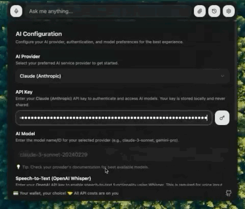

# Pluely 🚀

[](https://github.com/iamsrikanthnani/pluely)
[](https://tauri.app/)
[](https://reactjs.org/)
[](LICENSE)

### 💝 **Support the Project & Connect**

[](https://www.buymeacoffee.com/srikanthnani) &nbsp; [](mailto:srikanthnani1202@gmail.com?subject=Hiring%20Inquiry%20-%20Pluely%20Developer&body=Hi%20Srikanth,%0D%0A%0D%0AI%20came%20across%20your%20Pluely%20project%20and%20I'm%20interested%20in%20discussing%20potential%20opportunities.%0D%0A%0D%0ABest%20regards)

**Socials:**
[](https://github.com/iamsrikanthnani)
[](https://x.com/truly_sn)
[](https://www.srikanthnani.com/)
[](https://www.linkedin.com/in/iamsrikanthnani/)

</div>

> **The Open Source Alternative to Cluely** - A lightning-fast, privacy-first AI assistant that works seamlessly during meetings, interviews, and conversations without anyone knowing.

This is the **open source version** of the $15M company [Cluely](https://cluely.com/) 🎯. Experience the same powerful real-time AI assistance, but with complete transparency, privacy, and customization control.

## 📥 **Download Pluely**

<div align="center">

### 🚀 **Get the Latest Release**

[](https://github.com/iamsrikanthnani/pluely/releases/latest) &nbsp; [](https://github.com/iamsrikanthnani/pluely/releases/latest) &nbsp; [](https://github.com/iamsrikanthnani/pluely/releases/latest)

[](https://github.com/iamsrikanthnani/pluely/releases/latest) &nbsp; [](https://github.com/iamsrikanthnani/pluely/releases)

**Available formats:** `.dmg` (macOS) • `.msi` (Windows) • `.deb` (Linux)

</div>

---

## ⚡ **The Ultimate Lightweight AI Companion**

<div align="center">

### 🎯 **Just 10MB • Always On Display • One Click Away**

**The world's most efficient AI assistant that lives on your desktop**

|       🪶 **Ultra Lightweight**       |         📺 **Always Visible**         |          ⚡ **Instant Access**          |
| :----------------------------------: | :-----------------------------------: | :-------------------------------------: |
|    **Only ~10MB** total app size     | **Translucent overlay** on any window | **One click** to activate AI assistance |
| **27x smaller** than Cluely (~270MB) |    Always on top, never intrusive     | Overlaps seamlessly with your workflow  |
|   **50% less compute power** usage   |      Perfect transparency level       |       Ready when you need it most       |

</div>

#### 📊 **Pluely vs Original Cluely**

|       Feature       |   🟢 **Pluely (Open Source)**   |      🔴 **Original Cluely**       |
| :-----------------: | :-----------------------------: | :-------------------------------: |
|    **App Size**     |          **~10MB** ⚡           |           **~270MB** 🐌           |
| **Size Difference** |       **27x Smaller** 🪶        | Bloated with unnecessary overhead |
|  **Compute Usage**  |     **50% Less CPU/RAM** 💚     |    Heavy resource consumption     |
|  **Startup Time**   |          **<100ms** ⚡          |          Several seconds          |
|     **Privacy**     | **100% Local with your LLM** 🔒 |       Data sent to servers        |
|      **Cost**       |    **Free & Open Source** 💝    |    **$15M company pricing** 💸    |

---

## ⌨️ **Keyboard Shortcuts**

Pluely comes with powerful global keyboard shortcuts that work from anywhere on your system:

<div align="center">

| **Shortcut**      | **macOS**         | **Windows/Linux**  | **Function**                                             |
| :---------------- | :---------------- | :----------------- | :------------------------------------------------------- |
| **Toggle Window** | `Cmd + \`         | `Ctrl + \`         | Show/Hide the main window + app icon (based on settings) |
| **Voice Input**   | `Cmd + Shift + A` | `Ctrl + Shift + A` | Start voice recording                                    |
| **Screenshot**    | `Cmd + Shift + S` | `Ctrl + Shift + S` | Capture screenshot                                       |
| **System Audio**  | `Cmd + Shift + M` | `Ctrl + Shift + M` | Toggle system audio capture                              |

</div>

## 🎯 **App Icon Stealth Mode**

**Complete stealth mode control integrated with main toggle:**

- **Show Mode** (Default): App icon remains visible in dock/taskbar when window is hidden
- **Hide Mode**: App icon completely disappears from dock/taskbar when window is hidden (app keeps running in background)
- **Settings Control**: Configure dock/taskbar icon visibility in Settings → App Icon Visibility
- **Auto-Integration**: Works automatically with main toggle shortcut (`Cmd+\` / `Ctrl+\`) based on your settings
- **Cross-Platform**: Works seamlessly on macOS (ActivationPolicy::Accessory), Windows (skip_taskbar), and Linux (skip_taskbar)

**Perfect for maximum discretion during sensitive meetings and conversations - the app icon disappears from dock/taskbar but app remains fully functional!**

---

## 🔊 **System Audio Capture**

#### Why Setup Required?

**🔒 Security by Design**: Operating systems block direct system audio access for privacy protection - this is universal across all platforms and applications.

**⚙️ Quick Setup Process**:

- **macOS**: Install BlackHole (free) + Audio MIDI Setup (5 min)
- **Windows**: Enable built-in Stereo Mix OR install VB-Cable (free) (3 min)
- **Linux**: Use built-in PulseAudio monitors (usually works out-of-box)

**[📖 Complete Audio Setup Guide](SYSTEM_AUDIO_SETUP.md)** • **Step-by-step for all platforms**

---

## 🎥 **Live Demos**

### 💬 **Input Methods Demo**

Experience multiple input methods including text entry, and image pasting:

<div>

|                                  Input Example 1                                  |                                      Input Example 2                                       |
| :-------------------------------------------------------------------------------: | :----------------------------------------------------------------------------------------: |
|                      |                               |
| _Clean, intuitive text interface with markdown support for seamless conversation_ | _Image pasting functionality that automatically adds files to attachments for AI analysis_ |

</div>

---

### 📸 **Screenshot Demo**

Capture and analyze screenshots with automatic or manual modes for different use cases:

<div>

|                                                Manual Mode Screenshot                                                |
| :------------------------------------------------------------------------------------------------------------------: |
|                                            |
| _Screenshots are captured and automatically added to your attached files for manual submission with your own prompt_ |

|                                     Auto Mode Screenshot                                      |
| :-------------------------------------------------------------------------------------------: |
|                         |
| _Screenshots are automatically submitted to AI using your custom prompt for instant analysis_ |

</div>

---

### 🎤 **Voice Input Demo**

Speak naturally and get instant AI responses with advanced voice activity detection:

<div>


_Real-time speech-to-text using OpenAI Whisper with automatic voice detection - just speak and get AI responses_

</div>

---

### 📚 **Conversation History**

Keep track of all your AI interactions with persistent conversation history:

<div>


_Browse through previous conversations, search chat history, and continue where you left off_

</div>

---

## 🔧 **Setup**

### 🔧 **AI Provider Setup**

Get started with your preferred AI provider in seconds. Pluely supports all major LLM providers with dynamic model fetching, custom providers, and seamless integration:

<div align="center">

|                                                         Custom Provider Setup                                                          |                                                OpenAI Setup                                                 |
| :------------------------------------------------------------------------------------------------------------------------------------: | :---------------------------------------------------------------------------------------------------------: |
|                                                         |                                            |
| _Add your custom provider and select the provider from AI providers in the AI Providers section, then enter your API key and AI model_ | _Add your OpenAI API key and select from dynamically fetched models including GPT-4, GPT-4 Turbo, and more_ |

|                                      Google Gemini Setup                                      |                                       xAI Grok Setup                                        |
| :-------------------------------------------------------------------------------------------: | :-----------------------------------------------------------------------------------------: |
|                       |                            |
| _Connect to Google Gemini with your API key and choose from available models like Gemini Pro_ | _Integrate with xAI Grok - dynamically fetches available models for seamless AI assistance_ |

|                              Anthropic Claude Setup                               |                              Additional AI Providers                               |
| :-------------------------------------------------------------------------------: | :--------------------------------------------------------------------------------: |
|        |     **🔸 Mistral AI**<br>**🔸 Groq**<br>**🔸 Cohere**<br>**🔸 Perplexity AI**      |
| _Enter your Claude API key and model name manually for powerful AI conversations_ | _These providers are also available in the AI Providers settings for more options_ |

</div>

#### ⚙️ **Provider Configuration**

Each provider comes pre-configured with optimal settings:

- **🔄 Dynamic Model Fetching**: Automatically fetch latest models from OpenAI, xAI, Gemini, Mistral, and Groq
- **🎯 Manual Model Selection**: For Claude and Cohere, enter your preferred model name
- **🔐 Secure Authentication**: API keys stored locally in browser storage
- **📡 Streaming Support**: Real-time responses for all providers
- **🖼️ Multi-Modal**: Image analysis support where available
- **⚡ Fast Integration**: One-click setup for instant AI assistance

#### 🚀 **Quick Setup Guide**

1. **Choose Your Provider**: Select from the comprehensive list in Settings
2. **Enter API Key**: Add your provider's API key securely
3. **Select Model**: Choose from dynamically fetched models or enter manually
4. **Start Chatting**: Begin your AI-powered conversations immediately

#### 🔧 **Custom Provider Support**

For providers not in our list, use the custom provider option:

- Add any OpenAI-compatible API endpoint
- Configure custom authentication methods
- Set up your own response parsing
- Full flexibility for any LLM service

---

### 🎤 **Speech-to-Text Provider Setup**

Pluely supports advanced voice input with multiple speech-to-text providers for accurate, real-time transcription. Choose from industry-leading STT services or add your own custom provider:

<div align="center">

| **Provider**                 | **Auth Type**    | **Features**                        | **Model**            |
| :--------------------------- | :--------------- | :---------------------------------- | :------------------- |
| **🎤 OpenAI Whisper**        | Bearer Token     | High accuracy, fast processing      | whisper-1            |
| **⚡ Groq Whisper**          | Bearer Token     | Ultra-fast transcription            | whisper-large-v3     |
| **🔊 ElevenLabs STT**        | xi-api-key       | Natural language processing         | scribe_v1            |
| **🔍 Google Speech-to-Text** | Bearer Token     | Advanced language detection         | N/A                  |
| **🎯 Deepgram STT**          | Bearer Token     | Real-time processing                | nova-2               |
| **🧠 IBM Watson STT**        | Basic API Key    | Enterprise-grade accuracy           | en-US_BroadbandModel |
| **☁️ Azure Speech-to-Text**  | Subscription Key | Cloud-native processing             | N/A                  |
| **🎵 Speechmatics**          | Bearer Token     | High accuracy for various languages | N/A                  |
| **🤖 Zhipu GLM-ASR**         | Bearer Token     | Chinese language specialist         | glm-asr              |
| **🚀 Doubao STT**            | Bearer Token     | Fast Chinese transcription          | whisper-1            |

</div>

#### 🎙️ **STT Provider Features**

- **🎯 Real-time Processing**: Instant speech recognition with voice activity detection
- **🌍 Multi-Language Support**: Choose providers optimized for specific languages
- **⚡ Fast & Accurate**: Industry-leading transcription accuracy and speed
- **🔒 Secure Authentication**: API keys stored locally and securely
- **🎨 Seamless Integration**: Works with Pluely's voice input features

#### 🛠️ **Custom STT Provider Setup**

Can't find your preferred speech-to-text provider? Add custom STT providers with full configuration control:

- **🔧 Flexible API Integration**: Support for any REST API endpoint
- **🔐 Custom Authentication**: Bearer tokens, API keys, or custom headers
- **📝 Request Customization**: Configure audio formats, parameters, and headers
- **🎯 Response Parsing**: Define custom response paths for transcription text
- **⚙️ Advanced Configuration**: Set up audio formats, sample rates, and more

#### 🚀 **Voice Input Quick Start**

1. **Select Provider**: Choose from the comprehensive STT provider list
2. **Configure API**: Enter your provider's API credentials securely
3. **Test Connection**: Verify your setup with a quick voice test
4. **Start Speaking**: Use voice input seamlessly in your conversations

---

## 🌟 Why Pluely?

### 👻 **Completely Undetectable & Stealth**

> **🎯 The Ultimate Stealth AI Assistant - Invisible to Everyone**

Pluely is engineered to be **completely invisible** during your most sensitive moments:

- **🔍 Undetectable in video calls** - Works seamlessly in Zoom, Google Meet, Microsoft Teams, Slack Huddles, and all other meeting platforms
- **📺 Invisible in screen shares** - Your audience will never know you're using AI assistance
- **📸 Screenshot-proof design** - Extremely difficult to capture in screenshots due to translucent overlay
- **🏢 Meeting room safe** - Won't appear on projectors or shared screens
- **🎥 Recording invisible** - Doesn't show up in meeting recordings or live streams
- **⚡ Instant hide/show** - Overlaps with any window on your PC/Desktop for quick access

**Perfect for confidential scenarios where discretion is absolutely critical.**

### 🔥 **Blazingly Fast with Tauri**

Built with **Tauri**, Pluely delivers native desktop performance with minimal resource usage:

- **Instant startup** - launches in milliseconds
- **10x smaller** than Electron apps (~10MB vs ~100MB)
- **Native performance** - no browser overhead
- **Memory efficient** - uses 50% less RAM than web-based alternatives
- **Cross-platform** - runs natively on macOS, Windows, and Linux

### 🛡️ **Privacy-First Architecture**

Unlike cloud-based solutions, Pluely keeps everything local:

- **Your data never touches any servers** - all processing happens locally and with your LLM provider
- **API keys stored securely** in your browser's localStorage
- **No telemetry or tracking** - your conversations stay private, not stored anywhere
- **Offline-first design** - works without internet (except for AI API calls)

## 🖥️ **Always-On, One Click Away**

Pluely sits quietly on your desktop, ready to assist instantly with zero setup time:

### 🎯 **Perfect for Sensitive Scenarios**

**Completely undetectable in all these critical situations:**

- **Job interviews** - Get real-time answers without anyone knowing you're using AI
- **Sales calls** - Access product information instantly while maintaining professionalism
- **Technical meetings** - Quick reference to documentation without breaking flow
- **Educational presentations** - Learning assistance that's invisible to your audience
- **Client consultations** - Professional knowledge at your fingertips, completely discrete
- **Live coding sessions** - Get syntax help, debug errors, explain algorithms without detection
- **Design reviews** - Analyze screenshots, get UI/UX suggestions invisibly
- **Writing assistance** - Grammar check, tone adjustment, content optimization in stealth mode
- **Board meetings** - Access information without anyone noticing
- **Negotiations** - Real-time strategy assistance that remains completely hidden

#### and many more use cases...

---

## 🚀 Features

### 🤖 **Multi-LLM Support**

Connect to any AI provider with built-in support for:

- **OpenAI** - Dynamically fetches models directly from OpenAI, select your own
- **Anthropic Claude** - Enter your model name manually
- **xAI Grok** - Dynamically fetches models directly from xAI, select your own
- **Google Gemini** - Dynamically fetches models directly from Gemini, select your own
- **Custom providers** - Coming soon

### 🎤 **Advanced Speech-to-Text**

Pluely offers **two powerful audio input methods**:

#### 🎤 **Default Input** (Microphone)

- **Voice Activity Detection (VAD)** using `@ricky0123/vad-react`
- **Real-time voice commands** - just speak and get AI responses
- **Works immediately** - no setup required on any platform

#### 🔊 **System Audio Capture** (Everything Your Computer Plays)

- **Meeting transcription** - capture Zoom, Teams, Google Meet audio
- **Video analysis** - transcribe YouTube, educational content, podcasts
- **Real-time processing** with automatic speech detection
- **Cross-platform support** - works on macOS, Windows, Linux
- **Setup required** - see [System Audio Setup Guide](SYSTEM_AUDIO_SETUP.md)

**With any industry-leading STT providers**: OpenAI Whisper, Groq, ElevenLabs, Google, Deepgram, and more!

### 📎 **Multi-Modal Input**

- **Text input** with markdown support
- **Image attachments** - analyze images, screenshots

### 🎨 **Beautiful, Invisible UI**

- **Translucent window** that overlays any application
- **Always on top** but never in the way
- **Minimal design** - focus on content, not interface
- **Dark/light theme** support

### 👻 **Advanced Stealth Features**

- **App Icon Stealth Mode** - Complete dock/taskbar invisibility for maximum discretion
- **Intelligent Icon Management** - Automatically hide/show based on window visibility settings
- **Cross-Platform Stealth** - Works seamlessly on macOS (Dock), Windows (Taskbar), and Linux (Panel)
- **Global Keyboard Shortcuts** - Control app from anywhere without detection

### ⚡ **Real-Time Streaming**

- **Chunked streaming** - see responses as they're generated
- **Cancellable requests** - stop generation anytime
- **Error handling** with retry mechanisms

---

## 🌍 Cross-Platform Compatibility

Pluely works seamlessly across all major operating systems with comprehensive audio capture support.

### 🎯 **Audio Capture Methods**

Pluely offers **multiple audio capture options** to work with any setup:

#### 🎤 **Default Input Capture** (Works Immediately)

- ✅ **No setup required** - works out of the box on all platforms
- ✅ **Uses your microphone** for voice input and commands
- ✅ **Perfect for**: Voice dictation, personal notes, voice commands
- ✅ **Supported**: macOS, Windows, Linux

#### 🔊 **System Audio Capture** (Advanced Setup)

- 🎯 **Captures everything your computer plays** - meetings, videos, music
- 🎯 **Perfect for**: Meeting transcription, video analysis, system audio monitoring
- ⚙️ **Requires**: Virtual audio device setup (platform-specific)
- ✅ **Supported**: macOS, Windows, Linux

### 🖥️ **Platform Support Matrix**

| Platform       | Default Input | System Audio | Virtual Audio Solutions                                          |
| -------------- | ------------- | ------------ | ---------------------------------------------------------------- |
| **🍎 macOS**   | ✅ Built-in   | ✅ Supported | BlackHole (free), Loopback ($109), SoundFlower                   |
| **🪟 Windows** | ✅ Built-in   | ✅ Supported | Stereo Mix (built-in), VB-Audio Cable (free), VoiceMeeter (free) |
| **🐧 Linux**   | ✅ Built-in   | ✅ Supported | PulseAudio Monitors (built-in), ALSA Loopback                    |

### 🎵 **System Audio Capture Capabilities**

Once configured, system audio capture enables transcription of:

- 🎥 **Meeting Audio**: Zoom, Teams, Google Meet, Discord, Slack
- 🎬 **Video Content**: YouTube, Netflix, Twitch, educational videos
- 🎵 **Music & Podcasts**: Spotify, Apple Music, podcast apps
- 🎮 **Game Audio**: Game commentary, streaming content
- 📞 **VoIP Calls**: Skype, WhatsApp calls, phone calls
- 📱 **Any System Audio**: Everything your computer plays

### 🛠️ **Setup Difficulty by Platform**

#### 🍎 **macOS Setup**

- **Default Input**: ✅ **Instant** - no setup required
- **System Audio**: ⚙️ **Easy** - install BlackHole, configure Multi-Output
- **Time**: ~5 minutes for system audio setup
- **Best Option**: BlackHole (free) or Loopback (paid but easier)

#### 🪟 **Windows Setup**

- **Default Input**: ✅ **Instant** - no setup required
- **System Audio**: ⚙️ **Easy** - enable Stereo Mix or install VB-Cable
- **Time**: ~3 minutes for system audio setup
- **Best Option**: Stereo Mix (built-in) or VB-Audio Cable (free)

#### 🐧 **Linux Setup**

- **Default Input**: ✅ **Instant** - no setup required
- **System Audio**: ⚙️ **Easy** - PulseAudio monitors usually work out-of-box
- **Time**: ~2 minutes for system audio setup
- **Best Option**: PulseAudio Monitor devices (usually pre-configured)

### 🔧 **Built-in Debug & Testing Tools**

Pluely includes comprehensive debugging tools for all platforms:

- **🔍 Device Debug**: Shows all available audio devices with detailed analysis
- **🎵 Audio Level Testing**: 3-second audio level test with real-time feedback
- **📊 Real-time Monitoring**: Live RMS/Peak audio level display in console
- **🎯 Smart Device Detection**: Automatically selects best available device
- **🔄 Auto-Recovery**: Handles device conflicts and "already running" errors

### 📚 **Comprehensive Documentation**

- **📖 [SYSTEM_AUDIO_SETUP.md](SYSTEM_AUDIO_SETUP.md)**: Complete setup guide for all platforms
- **🎯 Platform-specific instructions**: Step-by-step guides with screenshots
- **🔧 Troubleshooting**: Common issues and solutions for each OS
- **💡 Pro Tips**: Best practices and optimization recommendations

### 🚀 **Quick Start (Any Platform)**

1. **Download Pluely** for your platform from [releases](https://github.com/iamsrikanthnani/pluely/releases/latest)
2. **Install & Launch** the application
3. **Click the audio button** (headphones icon) in the interface
4. **Choose your method**:
   - **"🎤 Default Input"** - works immediately, no setup
   - **"🔄 System Audio"** - requires virtual audio setup (see [guide](SYSTEM_AUDIO_SETUP.md))
5. **Start speaking or play audio** - transcription begins automatically!

### 🎉 **Why Cross-Platform Matters**

- **🌐 Universal Access**: Use Pluely on any device, anywhere
- **🔄 Consistent Experience**: Same features and UI across all platforms
- **🛠️ Flexible Setup**: Multiple audio solutions to fit any environment
- **📈 Future-Proof**: Built with Tauri for native performance on all platforms

---

## 🛠️ Installation & Setup

### Prerequisites

- **Node.js** (v18 or higher)
- **Rust** (latest stable)
- **npm** or **yarn**

> **🎵 Audio Capabilities**: The built app includes full cross-platform audio support with both microphone input and system audio capture. See [SYSTEM_AUDIO_SETUP.md](SYSTEM_AUDIO_SETUP.md) for platform-specific setup guides.

### Quick Start

```bash
# Clone the repository
git clone https://github.com/iamsrikanthnani/pluely.git
cd pluely

# Install dependencies
npm install

# Start development server
npm run tauri dev
```

### Build for Production

```bash
# Build the application
npm run tauri build
```

This creates platform-specific installers in `src-tauri/target/release/bundle/`:

- **macOS**: `.dmg` file
- **Windows**: `.msi` installer
- **Linux**: `.deb` file

---

## 🔐 Security & Privacy

### **Local API Key Storage**

- API keys are stored in **browser localStorage** (not sent to any server)
- **No telemetry** - your keys never leave your device
- **Session-based** - keys can be cleared anytime

### **Secure API Communication**

- **Direct HTTPS** connections to AI providers
- **No proxy servers** - your requests go straight to the AI service
- **Request signing** handled locally
- **TLS encryption** for all API communications

### **Data Handling**

- **No conversation logging** - messages aren't stored anywhere
- **Temporary session data** - cleared on app restart
- **Local file processing** - images processed in-browser
- **No analytics** - completely private usage

### **Why Frontend API Calls Are Better**

Pluely makes API calls directly from your frontend because:

1. **🔒 Maximum Privacy**: Your conversations never touch our servers
2. **🚀 Better Performance**: Direct connection = faster responses
3. **📱 Always Local**: Your data stays on your device, always
4. **🔍 Transparent**: You can inspect every network request in dev tools
5. **⚡ No Bottlenecks**: No server capacity limits or downtime

---

## 🚀 Performance Optimizations

### **Tauri Advantages**

- **Native binary** - no JavaScript runtime overhead
- **Rust backend** - memory-safe, ultra-fast
- **Small bundle size** - ~10MB total app size
- **Instant startup** - launches in <100ms
- **Low memory usage** - typically <50MB RAM

### **Frontend Optimizations**

- **React 18** with concurrent features
- **TypeScript** for compile-time optimization
- **Vite** for lightning-fast development
- **Tree shaking** - only bundle used code
- **Lazy loading** - components load on demand

## 🧪 Development

### 🏗️ Architecture Overview

#### Frontend (React + TypeScript + Tauri)

```
src/
├── components/           # Reusable UI components
│   ├── completion/      # AI completion interface
│   │   ├── Audio.tsx    # Audio recording component
│   │   ├── AutoSpeechVad.tsx # Voice activity detection
│   │   ├── Files.tsx    # File handling component
│   │   ├── index.tsx    # Main completion component
│   │   └── Input.tsx    # Text input component
│   ├── Header/          # Application header
│   ├── history/         # Chat history components
│   │   ├── ChatHistory.tsx # Chat history management
│   │   ├── index.tsx    # History exports
│   │   └── MessageHistory.tsx # Message history display
│   ├── Markdown/        # Markdown rendering
│   ├── Selection/       # Text selection handling
│   ├── settings/        # Configuration components
│   │   ├── ai-configs/  # AI provider configurations
│   │   │   ├── CreateEditProvider.tsx # Custom AI provider setup
│   │   │   ├── CustomProvider.tsx # Custom provider component
│   │   │   ├── index.tsx # AI configs exports
│   │   │   └── Providers.tsx # AI providers list
│   │   ├── DeleteChats.tsx # Chat deletion functionality
│   │   ├── Disclaimer.tsx # Legal disclaimers
│   │   ├── index.tsx    # Settings panel
│   │   ├── ScreenshotConfigs.tsx # Screenshot configuration
│   │   ├── stt-configs/ # Speech-to-text configurations
│   │   │   ├── CreateEditProvider.tsx # Custom STT provider setup
│   │   │   ├── CustomProvider.tsx # Custom STT provider
│   │   │   ├── index.tsx # STT configs exports
│   │   │   └── Providers.tsx # STT providers list
│   │   └── SystemPrompt.tsx # Custom system prompt editor
│   ├── TextInput/       # Text input components
│   ├── ui/              # shadcn/ui component library
│   └── updater/         # Application update handling
├── config/              # Application configuration
│   ├── ai-providers.constants.ts # AI provider configurations
│   ├── constants.ts     # General constants
│   ├── index.ts         # Config exports
│   └── stt.constants.ts # Speech-to-text provider configs
├── contexts/            # React contexts
│   ├── app.context.tsx  # Main application context
│   ├── index.ts         # Context exports
│   └── theme.context.tsx # Theme management context
├── hooks/               # Custom React hooks
│   ├── index.ts         # Hook exports
│   ├── useCompletion.ts # AI completion hook
│   ├── useCustomProvider.ts # Custom provider hook
│   ├── useCustomSttProviders.ts # Custom STT providers hook
│   ├── useSettings.ts   # Settings management hook
│   ├── useVersion.ts    # Version management hook
│   └── useWindow.ts     # Window management hook
├── lib/                 # Core utilities
│   ├── chat-history.ts  # Chat history management
│   ├── functions/       # Core functionality modules
│   │   ├── ai-models.function.ts # AI model handling
│   │   ├── ai-response.function.ts # AI response processing
│   │   ├── common.function.ts # Common utilities
│   │   ├── index.ts     # Function exports
│   │   └── stt.function.ts # Speech-to-text functions
│   ├── storage/         # Local storage management
│   │   ├── ai-providers.ts # AI provider storage
│   │   ├── helper.ts    # Storage helpers
│   │   ├── index.ts     # Storage exports
│   │   └── stt-providers.ts # STT provider storage
│   ├── index.ts         # Lib exports
│   ├── utils.ts         # Utility functions
│   └── version.ts       # Version utilities
├── types/               # TypeScript type definitions
│   ├── ai-provider.type.ts # AI provider types
│   ├── completion.hook.ts # Completion hook types
│   ├── completion.ts    # Completion types
│   ├── context.type.ts  # Context types
│   ├── index.ts         # Type exports
│   ├── settings.hook.ts # Settings hook types
│   ├── settings.ts      # Settings types
│   └── stt.types.ts     # Speech-to-text types
├── App.tsx              # Main application component
├── main.tsx             # Application entry point
├── global.css           # Global styles
└── vite-env.d.ts        # Vite environment types
```

#### Backend (Tauri + Rust)

```
src-tauri/
├── src/
│   ├── main.rs          # Application entry point
│   ├── lib.rs           # Core Tauri setup and IPC handlers
│   └── window.rs        # Window management & positioning
├── build.rs             # Build script for additional resources
├── Cargo.toml           # Rust dependencies and build configuration
├── tauri.conf.json      # Tauri configuration (windows, bundles, etc.)
├── Cargo.lock           # Dependency lock file
├── capabilities/        # Permission configurations
│   └── default.json     # Default capabilities
├── gen/                 # Generated files
├── icons/               # Application icons (PNG, ICNS, ICO)
├── info.plist           # macOS application info
├── pluely.desktop       # Linux desktop file
└── target/              # Build output directory
```

### **Development Commands**

```bash
# Start Tauri development
npm run tauri dev

# Build for production
npm run build
npm run tauri build

# Type checking
npm run type-check

# Linting
npm run lint
```

---

## 🤝 Contributing

We welcome contributions! Here's how to get started:

> 💡 **Like this project?** Consider [buying me a coffee ☕](https://www.buymeacoffee.com/srikanthnani) or [hiring me](mailto:srikanthnani1202@gmail.com?subject=Hiring%20Inquiry%20-%20Pluely%20Developer) for your next project!

### **Development Setup**

```bash
# Fork and clone the repository
git clone https://github.com/iamsrikanthnani/pluely.git
cd pluely

# Install dependencies
npm install

# Start development
npm run tauri dev
```

### **Contributing Guidelines**

1. **Fork** the repository
2. **Create** a feature branch (`git checkout -b feature/amazing-feature`)
3. **Commit** your changes (`git commit -m 'Add amazing feature'`)
4. **Push** to the branch (`git push origin feature/amazing-feature`)
5. **Open** a Pull Request

### **Code Style**

- **TypeScript** for type safety
- **ESLint + Prettier** for formatting
- **Conventional Commits** for commit messages
- **Component documentation** with JSDoc

---

## 📄 License

This project is licensed under the **MIT License** - see the [LICENSE](LICENSE) file for details.

---

## 🙏 Acknowledgments

- **[Cluely](https://cluely.com/)** - Inspiration for this open source alternative
- **[Tauri](https://tauri.app/)** - Amazing desktop framework
- **[shadcn/ui](https://ui.shadcn.com/)** - Beautiful UI components
- **[@ricky0123/vad-react](https://github.com/ricky0123/vad)** - Voice Activity Detection
- **[OpenAI](https://openai.com/)** - GPT models and Whisper API
- **[Anthropic](https://anthropic.com/)** - Claude AI models
- **[xAI](https://x.ai/)** - Grok AI models
- **[Google](https://gemini.google.com/)** - Gemini AI models

---

## 🔗 Links

- **🎵 Audio Setup Guide**: [SYSTEM_AUDIO_SETUP.md](SYSTEM_AUDIO_SETUP.md) - Complete cross-platform audio configuration
- **Website**: [cluely.com](https://cluely.com/) (Original Cluely)
- **Documentation**: [GitHub Wiki](https://github.com/iamsrikanthnani/pluely/wiki)
- **Issues**: [GitHub Issues](https://github.com/iamsrikanthnani/pluely/issues)
- **Discussions**: [GitHub Discussions](https://github.com/iamsrikanthnani/pluely/discussions)

---

### 🌐 **Let's Connect**

[](https://github.com/iamsrikanthnani)&nbsp;
[](https://x.com/truly_sn)&nbsp;
[](https://www.srikanthnani.com/)&nbsp;
[](https://www.linkedin.com/in/iamsrikanthnani/)&nbsp;
[](LICENSE)

---

**Made with ❤️ by [Srikanth Nani](https://www.srikanthnani.com/)**

_Experience the power of Cluely, but with complete transparency and control over your data._
