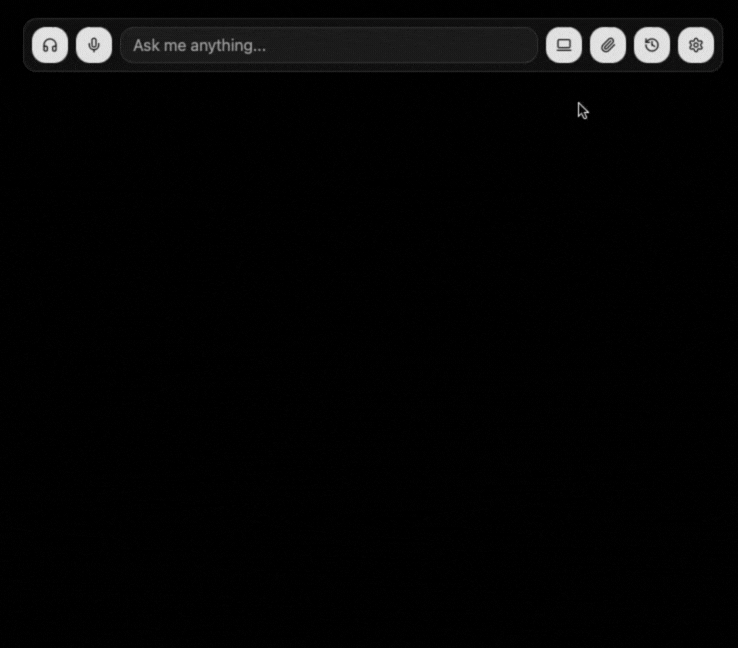

# Pluely 🚀

<a href="https://pluely.com/">
  
</a>

---

[](https://github.com/iamsrikanthnani/pluely)
[](https://tauri.app/)
[](https://reactjs.org/)
[](LICENSE)

### 💝 **Support the Project & Connect**

[](https://www.buymeacoffee.com/srikanthnani) &nbsp; [](mailto:srikanthnani1202@gmail.com?subject=Hiring%20Inquiry%20-%20Pluely%20Developer&body=Hi%20Srikanth,%0D%0A%0D%0AI%20came%20across%20your%20Pluely%20project%20and%20I'm%20interested%20in%20discussing%20potential%20opportunities.%0D%0A%0D%0ABest%20regards)

**Socials:**
[](https://github.com/iamsrikanthnani)
[](https://x.com/truly_sn)
[](https://www.srikanthnani.com/)
[](https://www.linkedin.com/in/iamsrikanthnani/)

</div>

> **The Open Source Alternative to Cluely** - A lightning-fast, privacy-first AI assistant that works seamlessly during meetings, interviews, and conversations without anyone knowing.

This is the **open source version** of the $15M company [Cluely](https://cluely.com/) 🎯. Experience the same powerful real-time AI assistance, but with complete transparency, privacy, and customization control.

## 📥 **Download Pluely**

<div align="center">

### 🚀 **Get the Latest Release**

[](https://pluely.com/download/macos) &nbsp; [](https://pluely.com/download/linux) &nbsp; [](https://pluely.com/download/windows)

[](https://pluely.com/releases) &nbsp; [](https://pluely.com/downloads)

**Available formats:** `.dmg` (macOS) • `.msi` (Windows) • `.exe` (Windows) • `.deb` (Linux) • `.rpm` (Linux) • `.AppImage` (Linux)

</div>

---

## ⚡ **The Ultimate Lightweight AI Companion**

<div align="center">

### 🎯 **Just 10MB • Always On Display • One Click Away**

**The world's most efficient AI assistant that lives on your desktop**

|       🪶 **Ultra Lightweight**       |         📺 **Always Visible**         |          ⚡ **Instant Access**          |
| :----------------------------------: | :-----------------------------------: | :-------------------------------------: |
|    **Only ~10MB** total app size     | **Translucent overlay** on any window | **One click** to activate AI assistance |
| **27x smaller** than Cluely (~270MB) |    Always on top, never intrusive     | Overlaps seamlessly with your workflow  |
|   **50% less compute power** usage   |      Perfect transparency level       |       Ready when you need it most       |

</div>

#### 📊 **Pluely vs Original Cluely**

|       Feature       |   🟢 **Pluely (Open Source)**   |      🔴 **Original Cluely**       |
| :-----------------: | :-----------------------------: | :-------------------------------: |
|    **App Size**     |          **~10MB** ⚡           |           **~270MB** 🐌           |
| **Size Difference** |       **27x Smaller** 🪶        | Bloated with unnecessary overhead |
|  **Compute Usage**  |     **50% Less CPU/RAM** 💚     |    Heavy resource consumption     |
|  **Startup Time**   |          **<100ms** ⚡          |          Several seconds          |
|     **Privacy**     | **100% Local with your LLM** 🔒 |       Data sent to servers        |
|      **Cost**       |    **Free & Open Source** 💝    |    **$15M company pricing** 💸    |

---

# Features

## ⌨️ **Keyboard Shortcuts**

Pluely comes with powerful global keyboard shortcuts that work from anywhere on your system:

<div align="center">

| **Shortcut**      | **macOS**         | **Windows/Linux**  | **Function**                                             |
| :---------------- | :---------------- | :----------------- | :------------------------------------------------------- |
| **Toggle Window** | `Cmd + \`         | `Ctrl + \`         | Show/Hide the main window + app icon (based on settings) |
| **Voice Input**   | `Cmd + Shift + A` | `Ctrl + Shift + A` | Start voice recording                                    |
| **Screenshot**    | `Cmd + Shift + S` | `Ctrl + Shift + S` | Capture screenshot                                       |
| **System Audio**  | `Cmd + Shift + M` | `Ctrl + Shift + M` | Toggle system audio capture                              |

</div>

## 🎯 **System Audio Capture**

_Note: Pluely system audio capture is actively in development and improving._

**Everything Your Computer Plays: Transform any audio on your system into an intelligent AI assistant with real-time transcription and contextual help:**


- **Real-Time AI Assistant:** 8 specialized modes for meetings, interviews, presentations, learning, and more
- **Background Processing:** Captures system audio continuously with smart context detection
- **Multi-Scenario Support:** Meeting insights, interview help, translation, presentation coaching, and learning assistance
- **Cross-Platform:** Works on macOS, Windows, and Linux with platform-specific audio routing
- **Settings Control:** Toggle system audio capture in Settings → Audio section
- **AI Integration:** Seamlessly connects transcription & completion to AI models for instant responses

#### Why Setup Required?

**🔒 Security by Design:** Operating systems block direct system audio access for privacy protection - this is universal across all platforms and applications.

**⚙️ Quick Setup Process:**

- **macOS:** Install BlackHole (free) + Audio MIDI Setup (5 min)
- **Windows:** Enable built-in Stereo Mix OR install VB-Cable (free) (3 min)
- **Linux:** Use built-in PulseAudio monitors (usually works out-of-box)

**[📖 Complete Audio Setup Guide](SYSTEM_AUDIO_SETUP.md)** • **Step-by-step for all platforms**

## 🎯 **Microphone Audio Capture**

**Voice Input: Transform your speech into an intelligent AI assistant with real-time transcription and contextual help:**


- **Voice Activity Detection:** Uses advanced VAD technology for automatic speech detection
- **Real-Time Processing:** Instant speech-to-text conversion with immediate AI responses
- **Keyboard Shortcuts:** Quick voice input with `Cmd+Shift+A` (macOS) or `Ctrl+Shift+A` (Windows/Linux)
- **No Setup Required:** Works immediately on any platform without additional configuration
- **Multi-STT Provider Support:** Choose from OpenAI Whisper, Groq, ElevenLabs, Google, Deepgram, and more
- **AI Integration:** Seamlessly connects transcription to AI models for instant contextual responses

## 🎯 **Interactive Input**

**Smooth, instant input that appears first for quick AI help - paste any images directly:**

Experience the seamless input flow that prioritizes speed and simplicity:

<div>

|                                   Input 1                                    |                                    Paste image 2                                    |
| :--------------------------------------------------------------------------: | :---------------------------------------------------------------------------------: |
|      |  |
| _Ultra-smooth text input that appears instantly for immediate AI assistance_ |       _Paste any images directly for instant AI analysis and contextual help_       |

</div>

- **Instant Focus:** Input automatically appears first whenever you show the window
- **Smooth Experience:** Ultra-responsive text input without any lag or delays
- **Image Pasting:** Paste any images directly from clipboard for instant AI analysis
- **Quick Access:** Always ready for immediate help with seamless hide/show transitions
- **Simple Interface:** Clean, distraction-free input that prioritizes speed
- **Smart Positioning:** Input field stays focused for continuous conversation flow

## 🎯 **Screenshot Capture**

**Capture and analyze screenshots with intelligent auto/manual modes for instant AI assistance:**

Experience two powerful screenshot modes that adapt to your workflow:

<div>

|                                               Manual Mode Screenshot                                                |
| :-----------------------------------------------------------------------------------------------------------------: |
|                                    |
| _Perfect for coding challenges - capture LeetCode problems and get step-by-step solutions with your custom prompts_ |

|                                                Auto Mode Screenshot                                                |
| :----------------------------------------------------------------------------------------------------------------: |
|                                       |
| _Ideal for single image - automatically analyze image content with your predefined AI prompt for instant insights_ |

</div>

- **Manual Mode:** Capture multiple screenshots submit to AI analysis, with a prompt
- **Auto Mode:** Screenshots automatically submit to AI using your saved custom prompt with instant analysis
- **Shortcuts:** Capture screenshots with `Cmd+Shift+S` (macOS) or `Ctrl+Shift+S` (Windows/Linux)
- **Smart Configuration:** Toggle between modes in Settings → Screenshot Configuration
- **Custom Prompts:** Define your auto-analysis prompt for consistent, personalized AI responses
- **Seamless Integration:** Screenshots work with all AI providers (OpenAI, Gemini, Claude, Grok, includes with your custom providers)
- **Privacy First:** Screenshots are processed locally and only sent to your chosen AI provider

## 🎯 **Always on Top**

**Control whether the Pluely window stays above all other applications for instant access:**


**Watch how the Pluely window stays perfectly visible above all other applications**

- **Enabled:** Window always appears on top of other applications
- **Disabled:** Window behaves like normal applications
- **Settings Control:** Toggle in Settings → Always On Top Mode
- **Independent Control:** Works separately from stealth features
- **Perfect for:** Quick access during meetings, presentations, or when you need instant AI assistance |

## 🎯 **App Icon Stealth Mode**

**Complete stealth mode control integrated with main toggle:**


**See how the toggle the app icon from your dock/taskbar while staying fully functional**

- **Show Mode** (Default): App icon remains visible in dock/taskbar when window is hidden
- **Hide Mode:** App icon completely disappears from dock/taskbar when window is hidden (app keeps running in background)
- **Settings Control:** Configure dock/taskbar icon visibility in Settings → App Icon Visibility
- **Auto-Integration:** Works automatically with main toggle shortcut (`Cmd+\` / `Ctrl+\`) based on your settings
- **Cross-Platform:** Works seamlessly on macOS (ActivationPolicy::Accessory), Windows (skip_taskbar), and Linux (skip_taskbar) |

## 🎯 **Element Titles Management**

**Complete control over title tooltips across the entire application:**


**See how to toggle all element title tooltips on/off globally with instant effect**

- **Show Mode** (Default): All button and interactive element tooltips are visible on hover
- **Hide Mode:** All title tooltips are completely hidden while elements remain fully functional
- **Settings Control:** Toggle in Settings → Element Titles to enable/disable globally
- **Instant Effect:** Changes apply immediately across all 50+ interactive elements
- **Accessibility Aware:** Perfect for users who prefer clean interfaces without tooltip clutter
- **Preserves Functionality:** Elements remain clickable and accessible, only tooltips are controlled |

### 📚 **Conversation History**

**Complete conversation management stored locally on your device:**

<div>


_Browse, reuse, download, and delete your AI conversations with complete local storage_

</div>

- **Local Storage** - All conversations saved to your device with zero data transmission
- **Instant Access** - History loads immediately with real-time updates
- **Message History** - See complete message threads with user/AI distinction
- **Reuse Chats** - Continue any conversation from where you left off with one click
- **Download Markdown** - Export conversations as formatted markdown files with timestamps
- **Delete Chats** - Remove individual conversations or delete all from Settings
- **Quick Navigation** - Browse all your conversations with auto-generated titles

---

## 🔧 **Setup**

### 🔧 **Activate Pluely License**

_Get Pluely API if you don't want to maintain your own providers_

**Unlock premium features, faster responses, advanced speech to text, and priority support with Pluely License:**



_Pluely License activation unlocks faster AI responses, premium features, and dedicated support_

#### **What You Get with Pluely License:**

- **Get Unlimited AI**: Unlimited AI interactions and responses
- **Faster AI Responses**: Optimized processing with dedicated infrastructure
- **Premium Features**: Access to advanced AI capabilities and upcoming features
- **Priority Support**: Direct support for any issues or questions
- **Exclusive Benefits**: Early access to new features and improvements

#### **How to Get Started:**

1. **Purchase License**: Click "Get License Key" to visit our secure checkout page
2. **Receive Key**: After payment, you'll receive your license key via email
3. **Activate**: Paste your license key in Settings → Pluely Access section
4. **Enjoy**: Start experiencing faster responses and premium features immediately

Switch between Pluely API and your custom providers anytime in Settings → Pluely Access. Whether you want the convenience of our optimized service or prefer to maintain your own AI provider setup, Pluely gives you complete flexibility.

### 🚀 **AI Provider Integration**

**Pluely now supports curl requests when adding custom providers, giving you ultimate flexibility to integrate any AI provider. This means you can connect to any LLM service using simple curl commands, opening up endless possibilities for your AI providers.**

### 🔧 **Custom AI Provider Setup**

**Unlock Any LLM Provider** - Pluely supports **any LLM provider** with full streaming and non-streaming capabilities. Configure custom endpoints, authentication, and response parsing for complete flexibility.


_See how easy it is to configure any AI provider with Pluely's custom provider setup_

#### **🔧 Dynamic Variables Support**

Pluely supports these **dynamic variables** that are automatically replaced:

| Variable            | Purpose                |
| ------------------- | ---------------------- |
| `{{TEXT}}`          | User's text input      |
| `{{IMAGE}}`         | Base64 image data      |
| `{{SYSTEM_PROMPT}}` | System instructions    |
| `{{MODEL}}`         | AI model name          |
| `{{API_KEY}}`       | API authentication key |

#### **Streaming & Response Configuration**

- **Streaming Support**: Toggle streaming on/off for real-time responses
- **Response Path**: Configure where to extract content from API responses (e.g., `choices[0].message.content`)
- **Authentication**: Support for Bearer tokens, API keys, and custom headers
- **Any Endpoint**: Works with any REST API that accepts JSON requests

#### **Custom Variable Creation**

Add your own variables using the `{{VARIABLE_NAME}}` format directly in your curl command. They'll appear as configurable fields when you select the provider.

---

### 🔧 **AI Providers Setup**

Get started with your preferred AI provider in seconds. Pluely supports all major LLM providers, custom providers, and seamless integration:

<div align="left">

|                                  OpenAI Setup                                  |                                     Grok setup                                     |
| :----------------------------------------------------------------------------: | :--------------------------------------------------------------------------------: |
|  |  |
|                 _Add your OpenAI API key and enter model name_                 |                  _Add your xAI Grok API key and enter your model_                  |

|                                  Google Gemini Setup                                  |                                  Anthropic Claude Setup                                  |
| :-----------------------------------------------------------------------------------: | :--------------------------------------------------------------------------------------: |
|  |  |
|                 _Add your Google Gemini API key and enter your model_                 |                 _Add your Anthropic Claude API key and enter your model_                 |

**Additional Providers:**

- **Mistral AI**: Add your Mistral API key and select from available models
- **Cohere**: Add your Cohere API key and enter your model name
- **Perplexity**: Add your Perplexity API key and select from available models
- **Groq**: Add your Groq API key and select from available models
- **Ollama**: Configure your local Ollama instance and select models

</div>

---

### 🚀 **Speech-to-Text Integration**

**Pluely now supports advanced curl-based integration for speech-to-text providers, giving you ultimate flexibility to integrate any STT service. This means you can connect to any speech API using simple curl commands, opening up endless possibilities for your voice workflows.**

### 🎤 **Speech-to-Text Provider Setup**

Get started with your preferred speech-to-text provider in seconds. Pluely supports all major STT providers, custom providers, and seamless voice integration:

<div align="left">

|                               OpenAI Whisper Setup                               |                                 ElevenLabs STT Setup                                 |
| :------------------------------------------------------------------------------: | :----------------------------------------------------------------------------------: |
|  |  |
|                _Add your OpenAI API key and select Whisper model_                |                    _Add your ElevenLabs API key and select model_                    |

**Additional STT Providers:**

- **Groq Whisper**: Add your Groq API key and select Whisper model
- **Google Speech-to-Text**: Add your Google API key for speech recognition
- **Deepgram STT**: Add your Deepgram API key and select model
- **Azure Speech-to-Text**: Add your Azure subscription key and configure region
- **Speechmatics**: Add your Speechmatics API key for transcription
- **Rev.ai STT**: Add your Rev.ai API key for speech-to-text
- **IBM Watson STT**: Add your IBM Watson API key and configure service

</div>

#### 🎙️ **STT Provider Configuration**

Each STT provider comes pre-configured with optimal settings:

- **🎯 Real-time Processing**: Instant speech recognition with voice activity detection
- **🌍 Multi-Language Support**: Choose providers optimized for specific languages
- **⚡ Fast & Accurate**: Industry-leading transcription accuracy and speed
- **🔒 Secure Authentication**: API keys stored locally and securely
- **🎨 Seamless Integration**: Works with Pluely's voice input features
- **🔧 Custom Variables**: Support for dynamic variables in custom STT providers
- **🌐 Any STT Provider**: Full compatibility with any speech recognition API endpoint

#### 🛠️ **Custom STT Provider Setup**

For STT providers not in our list, use the custom STT provider option with full control:

- **🌐 Any Speech Recognition API**: Add any STT provider with REST API support
- **🔐 Flexible Authentication**: Bearer tokens, API keys, custom headers, or direct key embedding
- **📡 Response Path Mapping**: Configure where to extract transcription text from any API response structure
- **🔧 Dynamic Variables**: Create custom variables using `{{VARIABLE_NAME}}` format in curl commands
- **📝 Request Customization**: Full control over headers, body structure, and parameters
- **⚙️ Audio Format Support**: Support for various audio formats and sample rates
- **🔄 Real-Time Testing**: Test your custom STT provider setup instantly

---

## 🌟 Why Pluely?

### 👻 **Completely Undetectable & Stealth**

> **🎯 The Ultimate Stealth AI Assistant - Invisible to Everyone**

Pluely is engineered to be **completely invisible** during your most sensitive moments:

- **🔍 Undetectable in video calls** - Works seamlessly in Zoom, Google Meet, Microsoft Teams, Slack Huddles, and all other meeting platforms
- **📺 Invisible in screen shares** - Your audience will never know you're using AI assistance
- **📸 Screenshot-proof design** - Extremely difficult to capture in screenshots due to translucent overlay
- **🏢 Meeting room safe** - Won't appear on projectors or shared screens
- **🎥 Recording invisible** - Doesn't show up in meeting recordings or live streams
- **⚡ Instant hide/show** - Overlaps with any window on your PC/Desktop for quick access

**Perfect for confidential scenarios where discretion is absolutely critical.**

### 🔥 **Blazingly Fast with Tauri**

Built with **Tauri**, Pluely delivers native desktop performance with minimal resource usage:

- **Instant startup** - launches in milliseconds
- **10x smaller** than Electron apps (~10MB vs ~100MB)
- **Native performance** - no browser overhead
- **Memory efficient** - uses 50% less RAM than web-based alternatives
- **Cross-platform** - runs natively on macOS, Windows, and Linux

### 🛡️ **Privacy-First Architecture**

Unlike cloud-based solutions, Pluely keeps everything local:

- **Your data never touches any servers** - all processing happens locally and with your LLM provider
- **API keys stored securely** in your browser's localStorage
- **No telemetry or tracking** - your conversations stay private, not stored anywhere
- **Offline-first design** - works without internet (except for AI API calls)

## 🖥️ **Always-On, One Click Away**

Pluely sits quietly on your desktop, ready to assist instantly with zero setup time:

### 🎯 **Perfect for Sensitive Scenarios**

**Completely undetectable in all these critical situations:**

- **Job interviews** - Get real-time answers without anyone knowing you're using AI
- **Sales calls** - Access product information instantly while maintaining professionalism
- **Technical meetings** - Quick reference to documentation without breaking flow
- **Educational presentations** - Learning assistance that's invisible to your audience
- **Client consultations** - Professional knowledge at your fingertips, completely discrete
- **Live coding sessions** - Get syntax help, debug errors, explain algorithms without detection
- **Design reviews** - Analyze screenshots, get UI/UX suggestions invisibly
- **Writing assistance** - Grammar check, tone adjustment, content optimization in stealth mode
- **Board meetings** - Access information without anyone noticing
- **Negotiations** - Real-time strategy assistance that remains completely hidden

#### and many more use cases...

---

## 🛠️ Installation & Setup

### Prerequisites

- **Node.js** (v18 or higher)
- **Rust** (latest stable)
- **npm** or **yarn**

> **🎵 Audio Capabilities**: The built app includes full cross-platform audio support with both microphone input and system audio capture. See [SYSTEM_AUDIO_SETUP.md](SYSTEM_AUDIO_SETUP.md) for platform-specific setup guides.

### Quick Start

```bash
# Clone the repository
git clone https://github.com/iamsrikanthnani/pluely.git
cd pluely

# Install dependencies
npm install

# Start development server
npm run tauri dev
```

### Build for Production

```bash
# Build the application
npm run tauri build
```

This creates platform-specific installers in `src-tauri/target/release/bundle/`:

- **macOS**: `.dmg` file
- **Windows**: `.msi` installer
- **Linux**: `.deb` file

---

## 🔐 Security & Privacy

### **Local API Key Storage**

- API keys are stored in **browser localStorage** (not sent to any server)
- **No telemetry** - your keys never leave your device
- **Session-based** - keys can be cleared anytime

### **Secure API Communication**

- **Direct HTTPS** connections to AI providers
- **No proxy servers** - your requests go straight to the AI service
- **Request signing** handled locally
- **TLS encryption** for all API communications

### **Data Handling**

- **No conversation logging** - messages aren't stored anywhere
- **Temporary session data** - cleared on app restart
- **Local file processing** - images processed in-browser
- **No analytics** - completely private usage

### **Why Frontend API Calls Are Better**

Pluely makes API calls directly from your frontend because:

1. **🔒 Maximum Privacy**: Your conversations never touch our servers
2. **🚀 Better Performance**: Direct connection = faster responses
3. **📱 Always Local**: Your data stays on your device, always
4. **🔍 Transparent**: You can inspect every network request in dev tools
5. **⚡ No Bottlenecks**: No server capacity limits or downtime

---

## 🚀 Performance Optimizations

### **Tauri Advantages**

- **Native binary** - no JavaScript runtime overhead
- **Rust backend** - memory-safe, ultra-fast
- **Small bundle size** - ~10MB total app size
- **Instant startup** - launches in <100ms
- **Low memory usage** - typically <50MB RAM

### **Frontend Optimizations**

- **React 18** with concurrent features
- **TypeScript** for compile-time optimization
- **Vite** for lightning-fast development
- **Tree shaking** - only bundle used code
- **Lazy loading** - components load on demand

## 🧪 Development

### 🏗️ Architecture Overview

#### Frontend (React + TypeScript + Tauri)

```
src/
├── components/           # Reusable UI components
│   ├── completion/      # AI completion interface
│   │   ├── Audio.tsx    # Audio recording component
│   │   ├── AutoSpeechVad.tsx # Voice activity detection
│   │   ├── Files.tsx    # File handling component
│   │   ├── index.tsx    # Main completion component
│   │   └── Input.tsx    # Text input component
│   ├── Header/          # Application header
│   ├── history/         # Chat history components
│   │   ├── ChatHistory.tsx # Chat history management
│   │   ├── index.tsx    # History exports
│   │   └── MessageHistory.tsx # Message history display
│   ├── Markdown/        # Markdown rendering
│   ├── Selection/       # Text selection handling
│   ├── settings/        # Configuration components
│   │   ├── ai-configs/  # AI provider configurations
│   │   │   ├── CreateEditProvider.tsx # Custom AI provider setup
│   │   │   ├── CustomProvider.tsx # Custom provider component
│   │   │   ├── index.tsx # AI configs exports
│   │   │   └── Providers.tsx # AI providers list
│   │   ├── DeleteChats.tsx # Chat deletion functionality
│   │   ├── Disclaimer.tsx # Legal disclaimers
│   │   ├── index.tsx    # Settings panel
│   │   ├── ScreenshotConfigs.tsx # Screenshot configuration
│   │   ├── stt-configs/ # Speech-to-text configurations
│   │   │   ├── CreateEditProvider.tsx # Custom STT provider setup
│   │   │   ├── CustomProvider.tsx # Custom STT provider
│   │   │   ├── index.tsx # STT configs exports
│   │   │   └── Providers.tsx # STT providers list
│   │   └── SystemPrompt.tsx # Custom system prompt editor
│   ├── TextInput/       # Text input components
│   ├── ui/              # shadcn/ui component library
│   └── updater/         # Application update handling
├── config/              # Application configuration
│   ├── ai-providers.constants.ts # AI provider configurations
│   ├── constants.ts     # General constants
│   ├── index.ts         # Config exports
│   └── stt.constants.ts # Speech-to-text provider configs
├── contexts/            # React contexts
│   ├── app.context.tsx  # Main application context
│   ├── index.ts         # Context exports
│   └── theme.context.tsx # Theme management context
├── hooks/               # Custom React hooks
│   ├── index.ts         # Hook exports
│   ├── useCompletion.ts # AI completion hook
│   ├── useCustomProvider.ts # Custom provider hook
│   ├── useCustomSttProviders.ts # Custom STT providers hook
│   ├── useSettings.ts   # Settings management hook
│   ├── useVersion.ts    # Version management hook
│   └── useWindow.ts     # Window management hook
├── lib/                 # Core utilities
│   ├── chat-history.ts  # Chat history management
│   ├── functions/       # Core functionality modules
│   │   ├── ai-models.function.ts # AI model handling
│   │   ├── ai-response.function.ts # AI response processing
│   │   ├── common.function.ts # Common utilities
│   │   ├── index.ts     # Function exports
│   │   └── stt.function.ts # Speech-to-text functions
│   ├── storage/         # Local storage management
│   │   ├── ai-providers.ts # AI provider storage
│   │   ├── helper.ts    # Storage helpers
│   │   ├── index.ts     # Storage exports
│   │   └── stt-providers.ts # STT provider storage
│   ├── index.ts         # Lib exports
│   ├── utils.ts         # Utility functions
│   └── version.ts       # Version utilities
├── types/               # TypeScript type definitions
│   ├── ai-provider.type.ts # AI provider types
│   ├── completion.hook.ts # Completion hook types
│   ├── completion.ts    # Completion types
│   ├── context.type.ts  # Context types
│   ├── index.ts         # Type exports
│   ├── settings.hook.ts # Settings hook types
│   ├── settings.ts      # Settings types
│   └── stt.types.ts     # Speech-to-text types
├── App.tsx              # Main application component
├── main.tsx             # Application entry point
├── global.css           # Global styles
└── vite-env.d.ts        # Vite environment types
```

#### Backend (Tauri + Rust)

```
src-tauri/
├── src/
│   ├── main.rs          # Application entry point
│   ├── lib.rs           # Core Tauri setup and IPC handlers
│   └── window.rs        # Window management & positioning
├── build.rs             # Build script for additional resources
├── Cargo.toml           # Rust dependencies and build configuration
├── tauri.conf.json      # Tauri configuration (windows, bundles, etc.)
├── Cargo.lock           # Dependency lock file
├── capabilities/        # Permission configurations
│   └── default.json     # Default capabilities
├── gen/                 # Generated files
├── icons/               # Application icons (PNG, ICNS, ICO)
├── info.plist           # macOS application info
├── pluely.desktop       # Linux desktop file
└── target/              # Build output directory
```

### **Development Commands**

```bash
# Start Tauri development
npm run tauri dev

# Build for production
npm run build
npm run tauri build

# Type checking
npm run type-check

# Linting
npm run lint
```

---

## 🤝 Contributing

We welcome contributions! Here's how to get started:

> 💡 **Like this project?** Consider [buying me a coffee ☕](https://www.buymeacoffee.com/srikanthnani) or [hiring me](mailto:srikanthnani1202@gmail.com?subject=Hiring%20Inquiry%20-%20Pluely%20Developer) for your next project!

### **Development Setup**

```bash
# Fork and clone the repository
git clone https://github.com/iamsrikanthnani/pluely.git
cd pluely

# Install dependencies
npm install

# Start development
npm run tauri dev
```

### **Contributing Guidelines**

1. **Fork** the repository
2. **Create** a feature branch (`git checkout -b feature/amazing-feature`)
3. **Commit** your changes (`git commit -m 'Add amazing feature'`)
4. **Push** to the branch (`git push origin feature/amazing-feature`)
5. **Open** a Pull Request

### **Code Style**

- **TypeScript** for type safety
- **ESLint + Prettier** for formatting
- **Conventional Commits** for commit messages
- **Component documentation** with JSDoc

---

## 📄 License

This project is licensed under the **MIT License** - see the [LICENSE](LICENSE) file for details.

---

## 🙏 Acknowledgments

- **[Cluely](https://cluely.com/)** - Inspiration for this open source alternative
- **[Tauri](https://tauri.app/)** - Amazing desktop framework
- **[shadcn/ui](https://ui.shadcn.com/)** - Beautiful UI components
- **[@ricky0123/vad-react](https://github.com/ricky0123/vad)** - Voice Activity Detection
- **[OpenAI](https://openai.com/)** - GPT models and Whisper API
- **[Anthropic](https://anthropic.com/)** - Claude AI models
- **[xAI](https://x.ai/)** - Grok AI models
- **[Google](https://gemini.google.com/)** - Gemini AI models

---

## 🔗 Links

- **🎵 Audio Setup Guide**: [SYSTEM_AUDIO_SETUP.md](SYSTEM_AUDIO_SETUP.md) - Complete cross-platform audio configuration
- **Website**: [cluely.com](https://cluely.com/) (Original Cluely)
- **Documentation**: [GitHub Wiki](https://github.com/iamsrikanthnani/pluely/wiki)
- **Issues**: [GitHub Issues](https://github.com/iamsrikanthnani/pluely/issues)
- **Discussions**: [GitHub Discussions](https://github.com/iamsrikanthnani/pluely/discussions)

---

### 🌐 **Let's Connect**

[](https://github.com/iamsrikanthnani)&nbsp;
[](https://x.com/truly_sn)&nbsp;
[](https://www.srikanthnani.com/)&nbsp;
[](https://www.linkedin.com/in/iamsrikanthnani/)&nbsp;
[](LICENSE)

---

**Made with ❤️ by [Srikanth Nani](https://www.srikanthnani.com/)**

_Experience the power of Cluely, but with complete transparency and control over your data._
